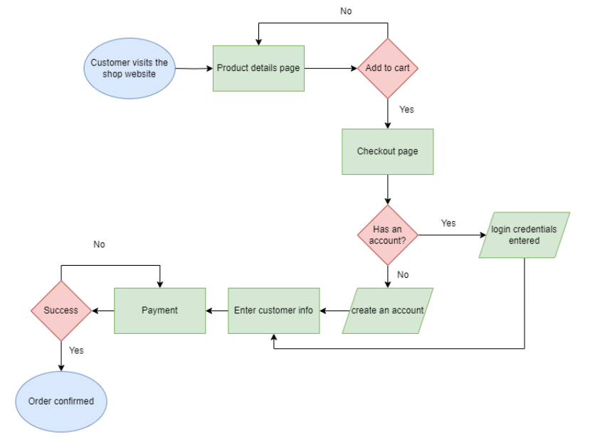
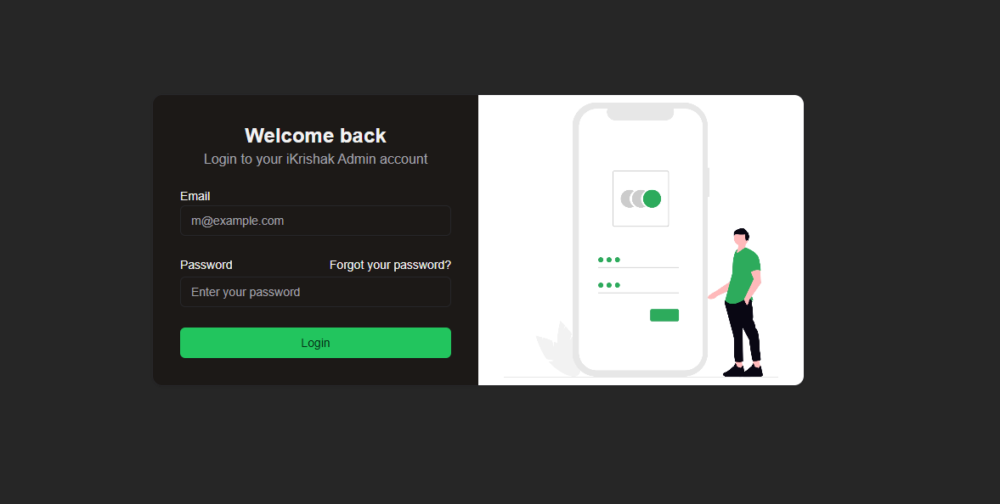
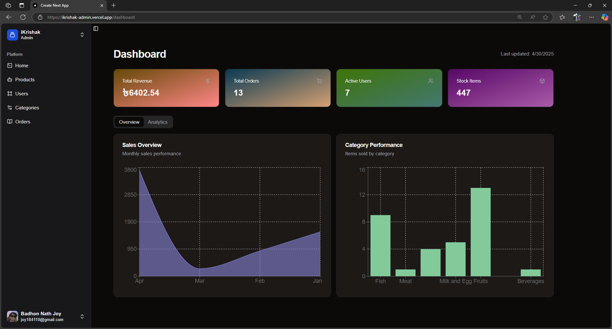
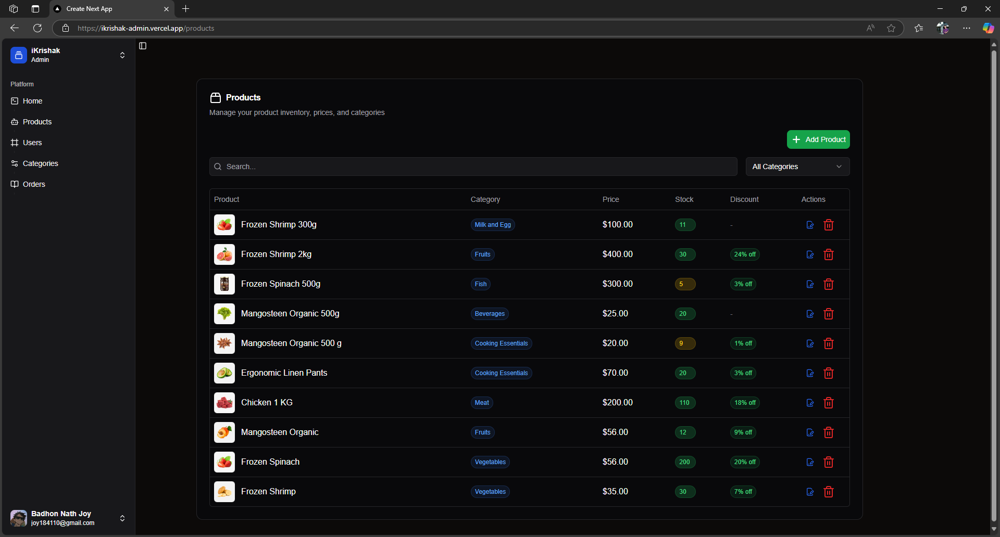

# iKrishak 🌱

[](https://opensource.org/licenses/MIT)
[](https://nextjs.org/)
[](https://expressjs.com/)

A platform bridging farmers and consumers for fresh agricultural products. Built with modern web technologies for scalability and security.

[iKrishak Demo](https://ikrishak.vercel.app) <!-- Replace with actual screenshot -->
## Team: SyntaxError
**Team Members**
- [8ad40n](https://github.com/8ad40n) (Team Leader)
- [nadim45448](https://github.com/nadim45448)
- [codeesh](https://github.com/codeesh)

**Mentor**
- [siam456](https://github.com/Siam456)
## Tech Stack 🛠️
**Frontend**  
| Component       | Technology       |
|-----------------|------------------|
| Framework       | Next.js      |
| Styling         | Tailwind CSS     |
| Component Library | ShadCN/ui      |

**Backend**  
| Component       | Technology       |
|-----------------|------------------|
| Framework       | Express.js       |
| Database        | MongoDB (Atlas)  |
| ORM             | Mongoose         |

**Services**  
- Authentication: JWT, Google OAuth
- Payments: Stripe API
- Email: Nodemailer

## 🚀 Project Setup

To run the iKrishak project locally, follow these steps for each part of the application: the backend (`/server`), the admin dashboard (`/admin-dashboard`), and the client frontend (`/client`).

---

### ✅ 1. Clone the Repository

```bash
git clone https://github.com/Learnathon-By-Geeky-Solutions/syntaxerror.git
```
```bash
cd syntaxerror
```
---
### ✅ 2. Backend Setup (/server)
The backend is built using Express.js and connected to MongoDB.
```bash
cd server
```
```bash
npm install
```
#### 📄 Environment Variables
Create a .env file in the /server directory with the following variables:
```bash
PORT=
DB_URI=
BYCRYPT_SALT=
JWT_SECRET=
EMAIL_ID=
EMAIL_PASSWORD=
EMAIL_HOST=
EMAIL_PORT=
EMAIL_SECURE=
CLOUDINARY_CLOUD_NAME=
CLOUDINARY_API_KEY=
CLOUDINARY_API_SECRET=
STRIPE_SECRET_KEY=
STRIPE_WEBHOOK_SECRET=
FRONTEND_URL=
BACKEND_URL=
```
#### ▶️ Start the Server
```bash
npm run start:dev
```
---
### ✅ 3. Client Frontend Setup (/client)
This is the consumer-facing frontend, built with Next.js, TailwindCSS, and ShadCN UI.
```bash
cd client
```
```bash
npm install
```
#### 📄 Environment Variables
Create a .env file in the /client directory with the following variables:
```bash
NEXT_PUBLIC_BASE_URL=
NEXTAUTH_SECRET=
GOOGLE_CLIENT_SECRET=
GOOGLE_CLIENT_ID=
GOOGLE_PASSWORD=
NEXT_PUBLIC_CLOUDINARY_CLOUD_NAME=
CLOUDINARY_API_KEY=
CLOUDINARY_API_SECRET=
NEXT_PUBLIC_CLOUDINARY_UPLOAD_PRESET=
```
#### ▶️ Start the Server
```bash
npm run dev
```
---
### ✅ 4. Admin Dashboard Setup (/admin-dashboard)
The admin panel is built using Next.js, TailwindCSS, and ShadCN UI.
```bash
cd admin-dashboard
```
```bash
npm install
```
#### 📄 Environment Variables
Create a .env file in the /admin-dashboard directory with the following variables:
```bash
NEXT_PUBLIC_BASE_URL=
NEXT_PUBLIC_CLOUDINARY_CLOUD_NAME=
CLOUDINARY_API_KEY=
CLOUDINARY_API_SECRET=
NEXT_PUBLIC_CLOUDINARY_UPLOAD_PRESET=
```
#### ▶️ Start the Server
```bash
npm run dev
```
---
## User Flow


## Admin Dashboard
✅ Admin Login




✅ Admin Dashboard




✅ Product Management




## Getting Started
1. Clone the repository
2. Install dependencies
3. Start development

## Development Guidelines
1. Create feature branches
2. Make small, focused commits
3. Write descriptive commit messages
4. Create pull requests for review

## Resources
- [Project Documentation](https://docs.google.com/document/d/1JJoQEqUjDCGsn5zY_JTCineFpa0qVziD6ytiXhV6rdo/edit?usp=sharing)
- [Development Setup](docs/setup.md)
- [Contributing Guidelines](CONTRIBUTING.md)
